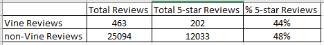

# Amazon Vine 5-Star Reviews Analysis
## Overview:
Amazon has a Vine program where members are paid to give reviews of products. A company pays a fee and provides products to Amazon Vine members in exchange for a review.
  
The purpose of this analysis was to determine if there is a bias in Vine members to give a 5-star review.  
  
The analysis was performed on a baby product.
## Results

* The total number of Vine member reivews in this dataset was 463, and non-Vine members was 25,094.
* Vine member reviews with 5 stars was 202, and for non-Vine members 12,033.
* The percentage of 5-star reviews for Vine members and non-Vine members respectively were 44% and 48%.
## Summary
There does not look to be a bias in 5-star reviews in Vine members.  
  
Additional analysis of the negative reviews may also be helpful to confirm this.
